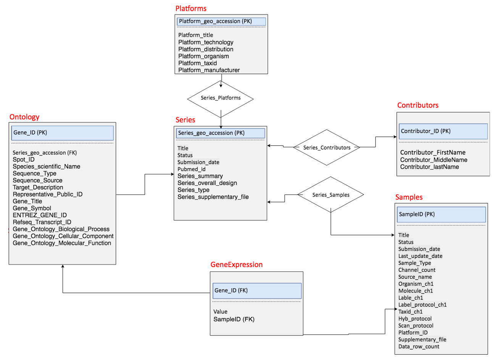

# GEOtoRELATIONAL
This code download GEO data (including soft files, series matrix files, xml.tgz files) from Series list, clean data and convert into relational database

## INSTALLATION

This program requires datamash installation and works on MAC Terminal only

## USAGE
The user needs to unzip the Ontology files before using these codes. 

sh command.sh GSEList
sh inputDDLandDMLToMysql.sh

# CODES

##  command.sh
This command download data from GEO, create sql code to insert each data type into the correct relational table as shown in ERD diagram. 

## inputDDLandDMLToMysql.sh
This command will automate all the sql commands to create a database.

# ERD diagram of relational database

